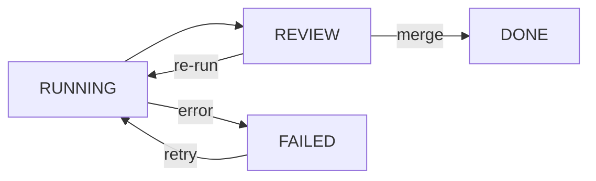

Review actions read GitHub pull request data and expose it as typed TypeScript objects. They also handle merging a PR and transitioning the task to `DONE`. All actions are TanStack Start server functions.

## getReviewPRList

Returns a list of all tasks in a project that have an associated pull request, along with their current PR state.

<ParamField path="projectId" type="string" required>
  UUID of the project.
</ParamField>

**Returns** `ReviewPRListItem[]`

```typescript
type ReviewPRListItem = {
  taskId: string
  taskTitle: string
  taskStatus: TaskStatus  // 'PENDING' | 'RUNNING' | 'REVIEW' | 'DONE' | 'FAILED' | 'SKIPPED'
  taskPhase: number
  taskCreatedAt: string   // ISO 8601
  geminiModel: string
  prNumber: number
  prUrl: string
  prTitle?: string | null
  prState?: 'open' | 'closed' | 'merged'
  prUpdatedAt?: string | null
}
```

<CodeGroup>

```typescript usage
import { getReviewPRList } from '@/lib/actions'

const items = await getReviewPRList({ projectId: 'abc-123' })
for (const item of items) {
  console.log(item.taskTitle, item.prState)
}
```

</CodeGroup>

<Note>
  Only tasks that have a `prUrl` or `prNumber` set are included in the list. Tasks that have never had a PR opened are excluded.
</Note>

---

## getReviewPRSummary

Fetches full details about a single pull request, including its metadata and all comments from both the agent and human reviewers.

<ParamField path="projectId" type="string" required>
  UUID of the project.
</ParamField>

<ParamField path="taskId" type="string" required>
  UUID of the task whose PR to fetch.
</ParamField>

**Returns** `ReviewPRSummary | null`

Returns `null` when the task has no associated pull request.

```typescript
type ReviewPRSummary = {
  taskId: string
  prNumber: number
  title: string
  body: string | null
  state: 'open' | 'closed' | 'merged'
  createdAt: string      // ISO 8601
  updatedAt: string      // ISO 8601
  headBranch: string
  baseBranch: string
  additions: number
  deletions: number
  changedFiles: number
  commits: number
  comments: ReviewPRComment[]
}

type ReviewPRComment = {
  id: string
  author: string
  authorType: 'agent' | 'user'  // 'agent' if the comment author matches GITHUB_BOT_USERNAME
  body: string
  createdAt: string             // ISO 8601
}
```

<CodeGroup>

```typescript usage
import { getReviewPRSummary } from '@/lib/actions'

const summary = await getReviewPRSummary({
  projectId: 'abc-123',
  taskId: 'task-456',
})

if (summary) {
  console.log(summary.title, summary.state)
  console.log(`+${summary.additions} -${summary.deletions}`)
}
```

</CodeGroup>

---

## getReviewPRFiles

Returns the list of files changed in the pull request, with per-file diff statistics and optional patch text.

<ParamField path="projectId" type="string" required>
  UUID of the project.
</ParamField>

<ParamField path="taskId" type="string" required>
  UUID of the task whose PR files to fetch.
</ParamField>

**Returns** `ReviewPRFile[]`

```typescript
type ReviewPRFile = {
  filename: string
  status: 'added' | 'modified' | 'removed' | 'renamed' | 'copied' | 'changed'
  additions: number
  deletions: number
  changes: number
  sha: string
  patch?: string | null          // Unified diff patch text
  previousFilename?: string | null // Only set when status is 'renamed'
}
```

<CodeGroup>

```typescript usage
import { getReviewPRFiles } from '@/lib/actions'

const files = await getReviewPRFiles({
  projectId: 'abc-123',
  taskId: 'task-456',
})

for (const file of files) {
  console.log(file.filename, file.status, `+${file.additions}/-${file.deletions}`)
}
```

</CodeGroup>

File comparison is done via the GitHub Commits Compare API using the base SHA and head SHA from the PR, so the diff is accurate even if additional commits were pushed after the PR was opened.

---

## mergePullRequest

Merges the pull request associated with the given task using a squash merge strategy. On success the task status is updated to `DONE`.

<ParamField path="projectId" type="string" required>
  UUID of the project.
</ParamField>

<ParamField path="taskId" type="string" required>
  UUID of the task whose PR to merge.
</ParamField>

**Returns**

```typescript
{ success: boolean; message: string }
```

<CodeGroup>

```typescript usage
import { mergePullRequest } from '@/lib/actions'

const result = await mergePullRequest({
  projectId: 'abc-123',
  taskId: 'task-456',
})

if (result.success) {
  console.log('Merged!')
} else {
  console.error(result.message)
}
```

</CodeGroup>

<Warning>
  Merging is irreversible. The action uses `squash` merge, so all commits from the agent's branch are squashed into a single commit on the base branch.
</Warning>

---

## PR state transitions

A task moves through the following states as the review lifecycle progresses:



| Task status | Meaning |
|---|---|
| `REVIEW` | The agent finished and opened a PR. Awaiting human review. |
| `DONE` | The PR was merged. No further action needed. |
| `FAILED` | The agent encountered an error. The task can be retried. |
