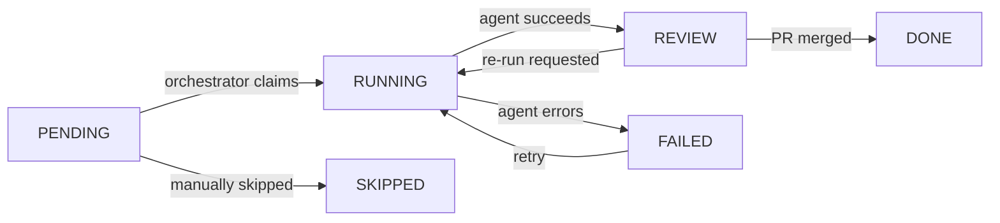

Tasks are the unit of work in Dev0. Each task maps to a discrete coding job assigned to the Gemini agent. When a task completes the agent opens a GitHub pull request.

## Schema

The `tasks` table is defined in `src/lib/db/schema.ts`.

```typescript
type Task = InferSelectModel<typeof tasks>
```

## Fields

<ResponseField name="id" type="string" required>
  UUID primary key. Auto-generated by the database.
</ResponseField>

<ResponseField name="projectId" type="string" required>
  UUID of the parent project. Foreign key to `projects.id`. Deleting the project cascades to delete all its tasks.
</ResponseField>

<ResponseField name="title" type="string" required>
  Short task title shown in the UI and used as the PR title prefix.
</ResponseField>

<ResponseField name="description" type="string | null">
  Detailed description of what the agent should implement. Injected into the agent prompt alongside the project spec.
</ResponseField>

<ResponseField name="phase" type="number" required>
  Execution phase number. Tasks within the same phase can potentially run in parallel. Tasks are ordered first by phase, then by `order`. Default: `1`.
</ResponseField>

<ResponseField name="order" type="number" required>
  Sequential order within the phase. Lower values run earlier. Default: `0`.
</ResponseField>

<ResponseField name="status" type="TaskStatus" required>
  Current execution status of the task. Default: `'PENDING'`.

  <Expandable title="status values">
    <ResponseField name="PENDING" type="string">
      The task has not started. It may be blocked by incomplete dependencies.
    </ResponseField>
    <ResponseField name="RUNNING" type="string">
      The orchestrator has claimed the task and the Gemini CLI is executing in a sandbox.
    </ResponseField>
    <ResponseField name="REVIEW" type="string">
      The agent finished successfully and opened a pull request. Awaiting human review and merge.
    </ResponseField>
    <ResponseField name="DONE" type="string">
      The pull request was merged. The task is complete.
    </ResponseField>
    <ResponseField name="FAILED" type="string">
      The agent encountered an error. The `attempts` counter is incremented. The task can be retried up to `maxAttempts`.
    </ResponseField>
    <ResponseField name="SKIPPED" type="string">
      The task was manually skipped. Downstream tasks treat a skipped task as if it were done when computing blocked status.
    </ResponseField>
  </Expandable>
</ResponseField>

<ResponseField name="geminiModel" type="'gemini-3-flash-preview' | 'gemini-3-pro-preview'" required>
  The Gemini model the orchestrator uses when running the task. Default: `'gemini-3-pro-preview'`.

  <Expandable title="model options">
    <ResponseField name="gemini-3-flash-preview" type="string">
      Faster and more cost-efficient. Best for routine tasks with clear requirements.
    </ResponseField>
    <ResponseField name="gemini-3-pro-preview" type="string">
      Higher capability. Used for complex tasks that require more reasoning.
    </ResponseField>
  </Expandable>
</ResponseField>

<ResponseField name="dependencies" type="string[]" required>
  Array of task UUIDs that must reach `DONE` or `SKIPPED` before this task is eligible to run. Empty array means no dependencies. Default: `[]`.
</ResponseField>

<ResponseField name="prUrl" type="string | null">
  HTTPS URL of the GitHub pull request opened by the agent. Set when the task transitions to `REVIEW`. `null` before then.
</ResponseField>

<ResponseField name="prNumber" type="number | null">
  GitHub pull request number. Set alongside `prUrl`.
</ResponseField>

<ResponseField name="logs" type="object[] | null">
  Legacy JSONB log field. Deprecated in favour of the `task_logs` table. May be `null`.
</ResponseField>

<ResponseField name="attempts" type="number" required>
  Number of times the task has been attempted. Incremented each time the task fails. Default: `0`.
</ResponseField>

<ResponseField name="maxAttempts" type="number" required>
  Maximum number of execution attempts before the task is considered permanently failed. Default: `3`.
</ResponseField>

<ResponseField name="createdAt" type="string" required>
  ISO 8601 timestamp set at insert time.
</ResponseField>

<ResponseField name="updatedAt" type="string" required>
  ISO 8601 timestamp updated automatically on every row change.
</ResponseField>

---

## Status enum

```typescript
type TaskStatus =
  | 'PENDING'
  | 'RUNNING'
  | 'REVIEW'
  | 'DONE'
  | 'FAILED'
  | 'SKIPPED'
```

Status transitions follow a defined lifecycle:



---

## Derived types

### TaskWithBlocked

Returned by `getProject`, `getProjectTasks`, and related actions. The `isBlocked` field is computed server-side — a `PENDING` task is blocked when it has unmet dependencies or when any earlier task in the sequence is not yet complete.

```typescript
type TaskWithBlocked = Task & {
  isBlocked: boolean
}
```

### TaskWithProject

Returned by `getTask` and `getTaskWithLogs`. Includes a summary of the parent project.

```typescript
type TaskWithProject = Task & {
  project: {
    id: string
    name: string
    repoName: string | null
    repoUrl: string | null
  }
}
```

### TaskWithLogs

Returned by `getTaskWithLogs`. Extends `TaskWithProject` with the lazily-loaded execution log record.

```typescript
type TaskWithLogs = Task & {
  executionLogs?: {
    id: string
    events: GeminiStreamEvent[]
    summary: string | null
    totalTokens: number | null
    durationMs: number | null
    toolCallsCount: number | null
  } | null
}
```

### CreateTaskData

Input shape for creating a task programmatically.

```typescript
type CreateTaskData = {
  projectId: string
  title: string
  description?: string
  phase: number
  order?: number
  dependencies?: string[]
}
```

---

## The agent-result.json contract

At the end of each execution the Gemini agent writes a JSON file to `$HOME/project/.dev0/runs/<taskId>/agent-result.json`. The orchestrator reads this file to extract the commit message and PR details.

```json
{
  "status": "success",
  "commitMessage": "feat: add drag-and-drop support to kanban board",
  "prTitle": "feat: drag-and-drop kanban board",
  "prBody": "## Summary\n\n- Added @hello-pangea/dnd library\n- Implemented draggable task cards...",
  "notes": "Used local storage for persistence as instructed."
}
```

| Field | Type | Description |
|---|---|---|
| `status` | `'success' \| 'failed'` | Whether the agent considers the task done. |
| `commitMessage` | `string` | Commit message for the squash commit. Falls back to `feat: complete task <title>` if absent. |
| `prTitle` | `string` | Pull request title. Falls back to `feat: <title>` if absent. |
| `prBody` | `string` | Pull request description in Markdown. |
| `notes` | `string` | Free-form notes from the agent, stored for debugging. |

<Note>
  The agent is instructed not to run `git commit`, `git push`, or `gh pr create` directly. The orchestrator handles all Git operations using the values from this file after the CLI exits.
</Note>

---

## Example record

```json
{
  "id": "018e5678-0000-7000-aaaa-000000000001",
  "projectId": "018e1234-5678-7000-abcd-ef0123456789",
  "title": "Implement drag-and-drop card movement",
  "description": "Allow users to drag task cards between Kanban columns. Use @hello-pangea/dnd.",
  "phase": 1,
  "order": 2,
  "status": "REVIEW",
  "geminiModel": "gemini-3-pro-preview",
  "dependencies": ["018e5678-0000-7000-aaaa-000000000000"],
  "prUrl": "https://github.com/dev0-agent/task-tracker/pull/3",
  "prNumber": 3,
  "logs": null,
  "attempts": 1,
  "maxAttempts": 3,
  "createdAt": "2025-01-15T10:01:00.000Z",
  "updatedAt": "2025-01-15T10:45:00.000Z"
}
```
